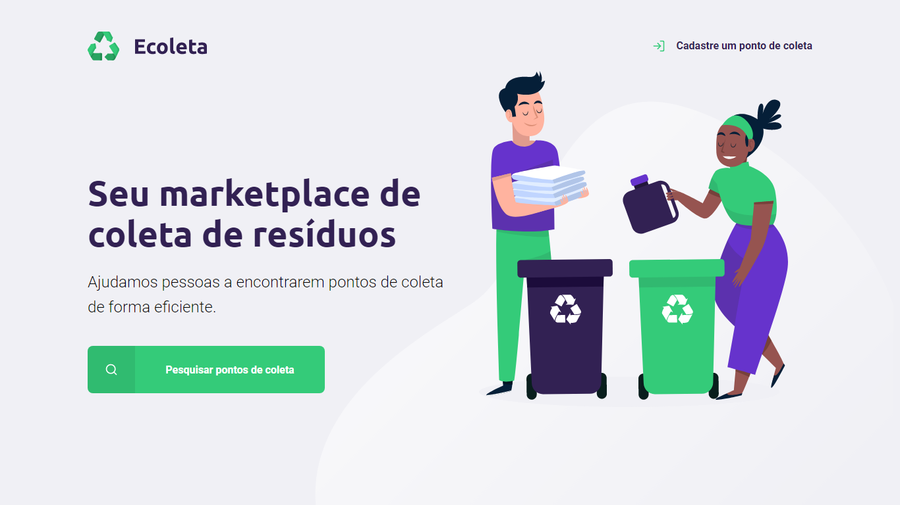

    

  <a href="#-tecnologias">Tecnologias</a>&nbsp;&nbsp;&nbsp;|&nbsp;&nbsp;&nbsp;
  <a href="#-projeto">Projeto</a>&nbsp;&nbsp;&nbsp;|&nbsp;&nbsp;&nbsp;
  <a href="#-layout">Layout</a>&nbsp;&nbsp;&nbsp;|&nbsp;&nbsp;&nbsp;
  <a href="#-licença">Licença</a>

 

    

 

## 🚀 TECNOLOGIAS

Esse projeto foi desenvolvido com as seguintes tecnologias:

- HTML
- CSS
- JavaScript
- [Node.js](https://nodejs.org/en/)
- [Express](https://expressjs.com/pt-br/)
- [SQLite](https://www.sqlite.org/index.html)
- [Nunjucks](https://mozilla.github.io/nunjucks/)

 

## 💻 PROJETO

O Ecoleta é um marketplace que ajuda pessoas a encontrarem pontos de coleta de resíduos de forma eficiente.

 

## 🔖 LAYOUT

Você pode visualizar o layout do projeto através [desse link](<https://www.figma.com/file/Byw4X5etg8VCmezueyhzkC/Ecoleta-(Starter)?node-id=136%3A546>). Lembrando que você precisa ter uma conta no [Figma](http://figma.com/) para acessá-lo.

 

## 📝 LICENÇA
Esse projeto está sob a licença MIT. Veja o arquivo [LICENSE](LICENSE.md) para mais detalhes.

 

---

    Feito por Fernando Oliveira Lopes durante a Primeira Edição da NLW - Next Level Week da Rocketseat.

Visite: 
 
[Rocketseat](https://rocketseat.com.br/)
 
[NLW - Next Level Week](https://nextlevelweek.com/)